# Learnings from data exploration

**TLDR: bias-variance trade off between ACLED and UCDP (acled: variance, ucdp: bias)**

## ACLED
comments
- an act of political violence or a demonstration is the sole basis for inclusion within the ACLED dataset
pros
- tends to have more data than UCDP
  - DRC: 7k vs 31k
  - SS: 0.9k vs 9k
- more inclusive, includes events that result in injury, but no deaths
- ACLED makes no requirement of an identifiable actor, no requirement of a fatality, and no requirement that the violence reach the threshold of 25 annual deaths as is required for inclusion in the UCDP dataset
cons
- geolocation: results will be biased
towards attributes associated with urban areas due to the imprecision in ACLED’s geoprecision coding
  - when location is not found, ACLED uses the provincial capital
  - researchers strongly encouraged to validate the data before using ACLED geo information 
  - check what percentage of events are coded with a certainty of 1 (precise location)
- non-violent events are only 8% of the total violent events in ACLED data
   - strong bias in what kinds of non-violent events are reported, so researchers should be careful in using these 
- ACLED does not specify what constitutes armed conflict, making it difficult to determine what behavior is included and what is excluded.

## UCDP
comments
-  defines a conflict event as “the incidence of the use of armed force by an organized actor against another organized actor, or against civilians, resulting in at least 1 direct death in either the best, low or high estimate categories at a specific location and for a specific temporal duration” 
- only registers events that result in fatalities
- only about 1/3 of the number of events in ACLED
  - except in the case of algeria and congo, unclear why 
- has a dyad focus; a conflict dyad is only coded once it crosses the 25 battle related deaths threshold in a given year (ACLED)
pros
- actor and conflict id (acled is missing this)    
- triple checking process means that the data is more accurately coded than ACLED (eck)
- geolocation: when location not found, uses the provincial centroid 
  - largely, geocoding and precision information is far superior to ACLED’s
cons
  - does not include events perpetrated by actors who purposefully do not kill many individuals yet terrorize populations
  - captures only the events of larger, organized groups who have set similar agendas

### existing comparisons
- [eck paper](https://www.urban-response.org/system/files/content/resource/files/main/a_83553-f_CoCo__Eck__final_.111204.release_vers.pdf)
  - UCDP GED has greater confidence that all events included in its dataset indeed are conflict events, but at the expense of excluding many of the diffuse and unidentifiable actions which occur in the context of civil war. ACLED is able to capture these events but at the expense of the conceptual validity of the data. It is up to the end-user to determine which of these datasets is more appropriate for the research question at hand.
- notes from [acled](https://www.acleddata.com/wp-content/uploads/2019/09/ACLED-Comparison_8.2019.pdf)

## comparing countries (gen in )

### comparable
south sudan 
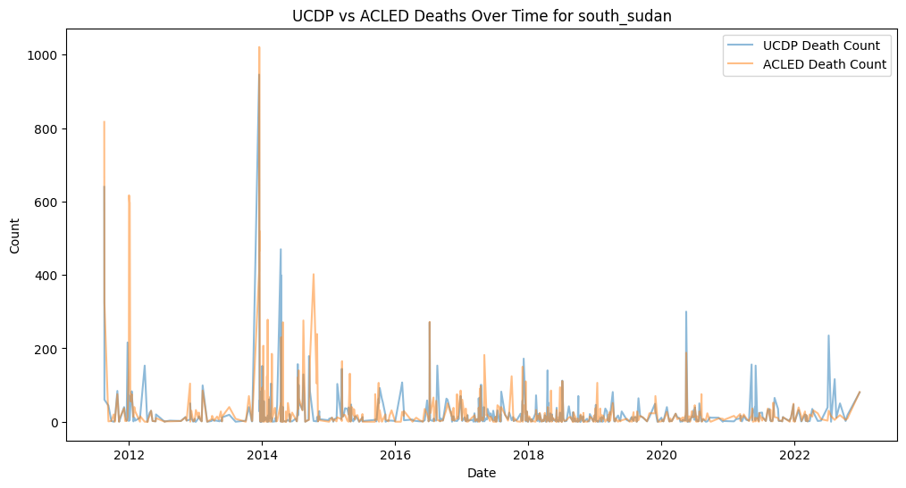
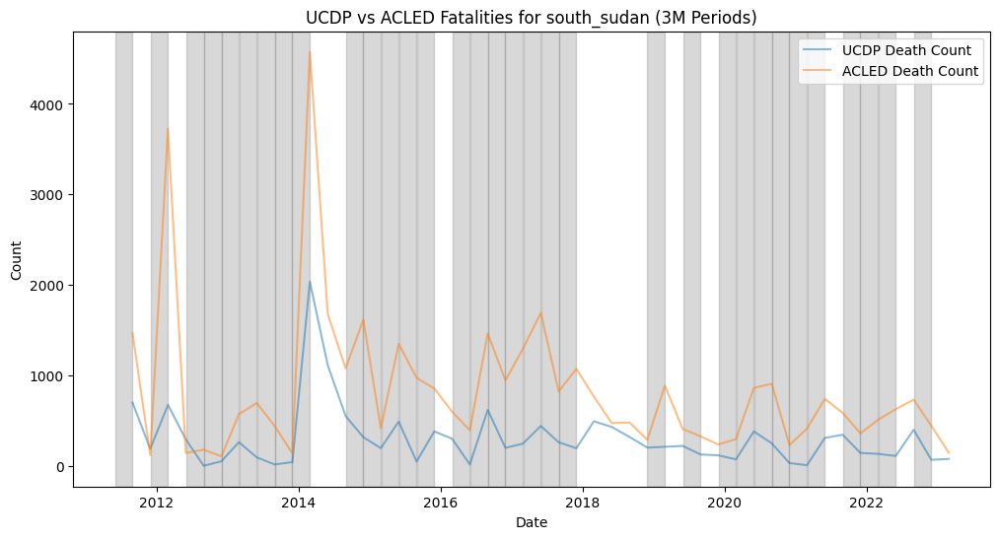

somali
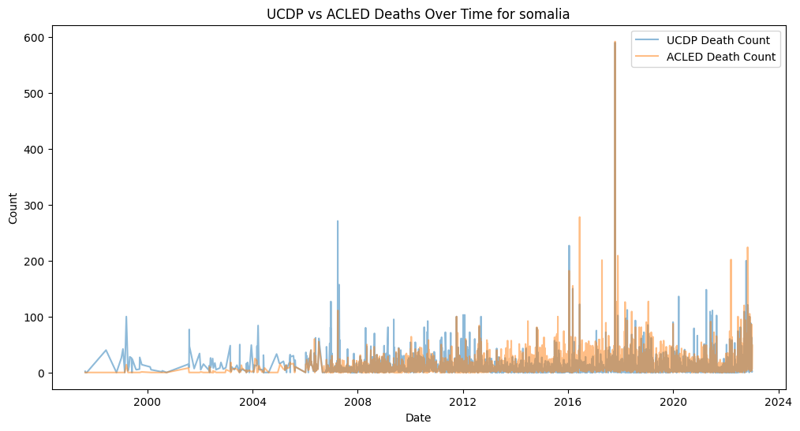
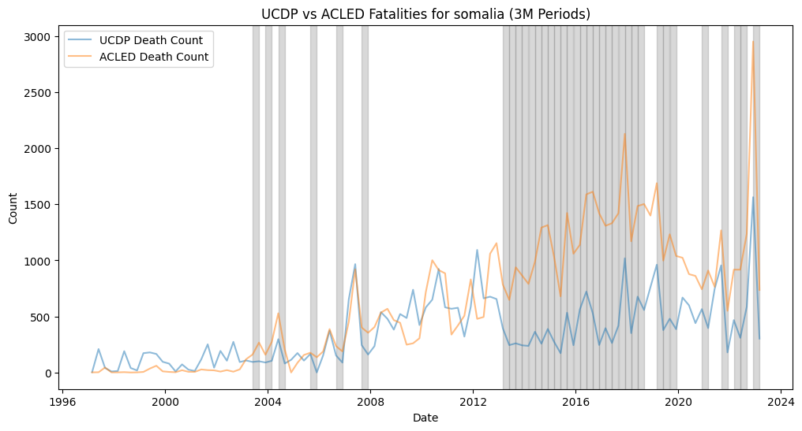

drc
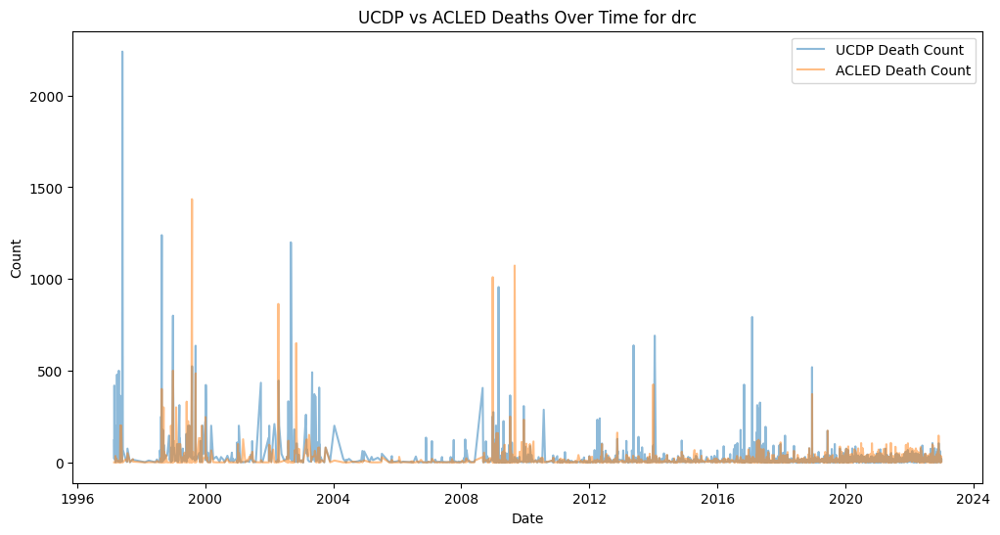
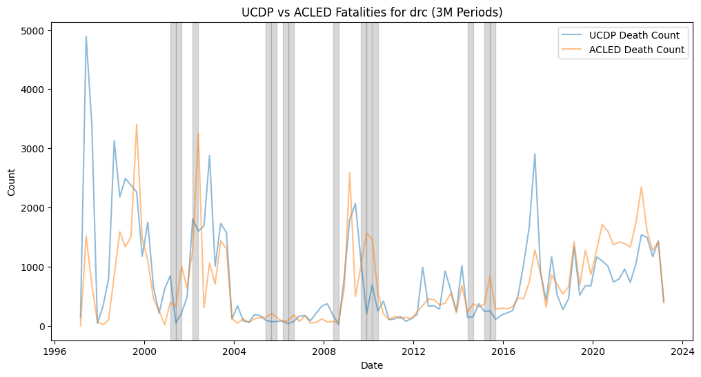

### bad examples
ethiopia
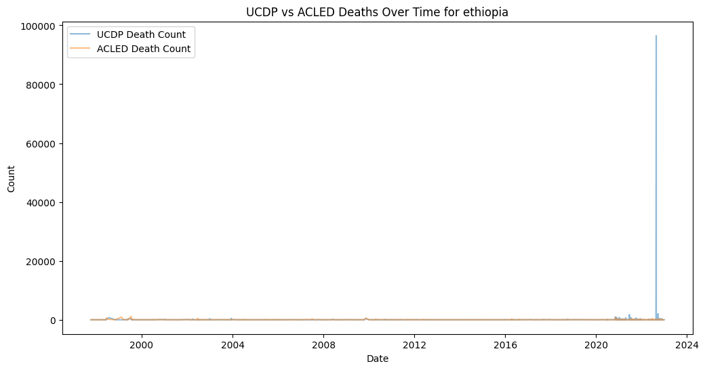

venezuela
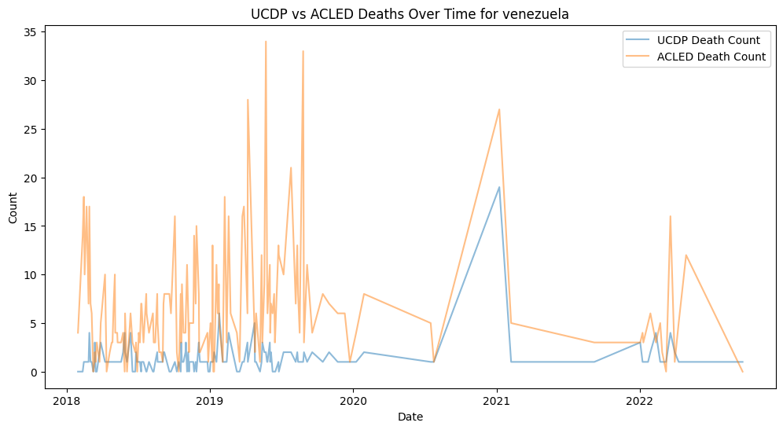
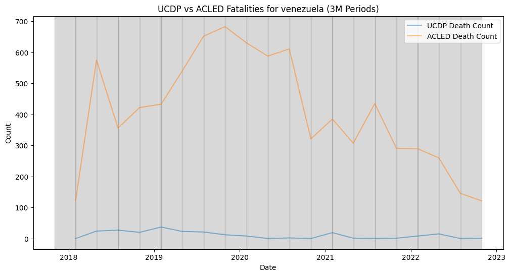

colombia
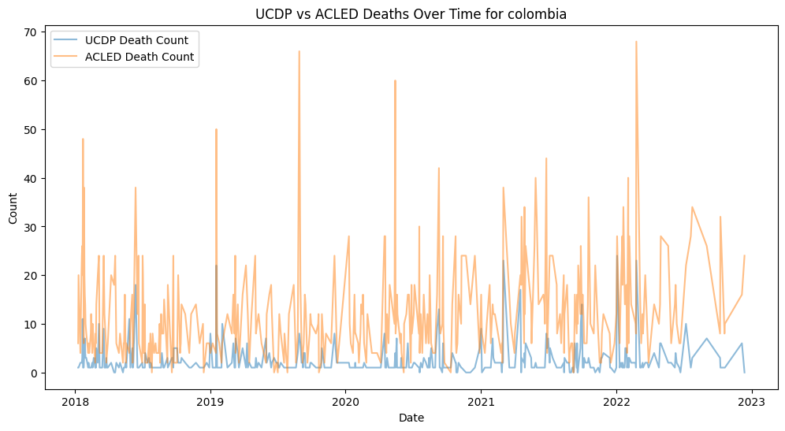
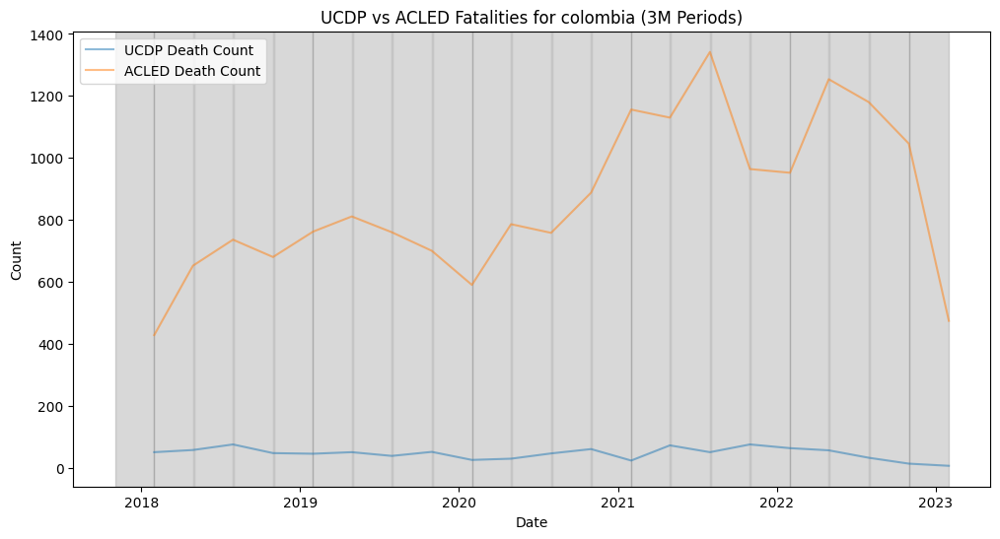