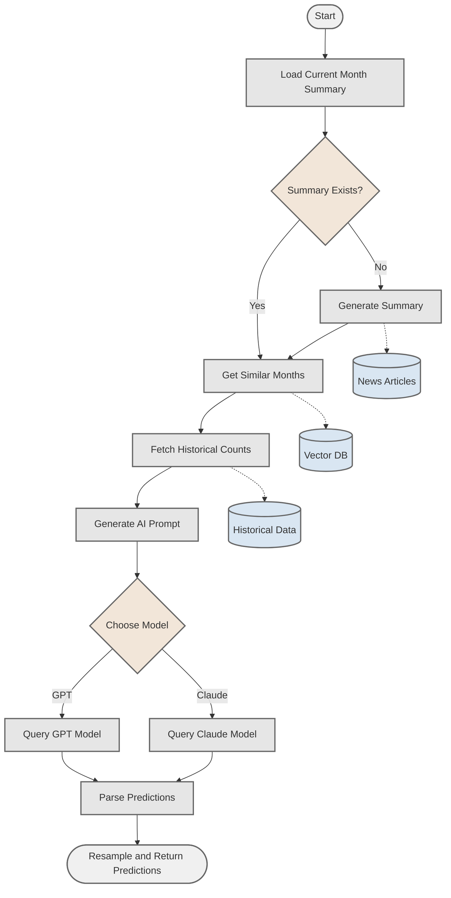

```mermaid
flowchart TD
    classDef processClass fill:#e6e6e6,stroke:#666,stroke-width:2px
    classDef dataClass fill:#d9e6f2,stroke:#666,stroke-width:2px,shape:cylinder
    classDef decisionClass fill:#f2e6d9,stroke:#666,stroke-width:2px,shape:diamond
    classDef outputClass fill:#e6f2e6,stroke:#666,stroke-width:2px

    A([Start]) --> B[Load Current Month Summary]
    B --> C{Summary Exists?}
    C -->|No| D[Generate Summary]
    C -->|Yes| E[Get Similar Months]
    D --> E
    E --> F[Fetch Historical Counts]
    F --> G[Generate AI Prompt]
    G --> H{Choose Model}
    H -->|GPT| I[Query GPT Model]
    H -->|Claude| J[Query Claude Model]
    I --> K[Parse Predictions]
    J --> K
    K --> M([Resample and Return Predictions])

    N[(Vector DB)]
    O[(Historical Data)]
    P[(News Articles)]

    E -.-> N
    F -.-> O
    D -.-> P

    class A,M outputClass
    class B,D,E,F,G,I,J,K,L processClass
    class C,H decisionClass
    class N,O,P dataClass

    style A fill:#f0f0f0,stroke:#666,stroke-width:2px
    style M fill:#f0f0f0,stroke:#666,stroke-width:2px
```