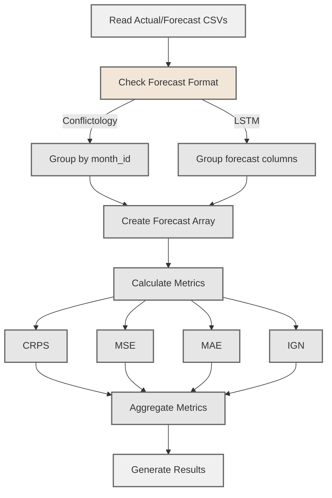

```mermaid
graph TD
    classDef processClass fill:#e6e6e6,stroke:#666,stroke-width:2px
    classDef dataClass fill:#d9e6f2,stroke:#666,stroke-width:2px
    classDef decisionClass fill:#f2e6d9,stroke:#666,stroke-width:2px,shape:diamond
    classDef outputClass fill:#e6f2e6,stroke:#666,stroke-width:2px

    A[Read Actual/Forecast CSVs]
    A --> C[Check Forecast Format]
    C -->|Conflictology| D[Group by month_id]
    C -->|LSTM| E[Group forecast columns]
    D --> F[Create Forecast Array]
    E --> F
    F --> G[Calculate Metrics]
    G --> H[CRPS]
    G --> I[MSE]
    G --> J[MAE]
    G --> L[IGN]
    H --> M[Aggregate Metrics]
    I --> M
    J --> M
    L --> M
    M --> N[Generate Results]

    class A,B,D,E,F,G,H,I,J,K,L,M,N processClass
    class C decisionClass
    class N outputClass

    style A fill:#f0f0f0,stroke:#666,stroke-width:2px
    style N fill:#f0f0f0,stroke:#666,stroke-width:2px
```