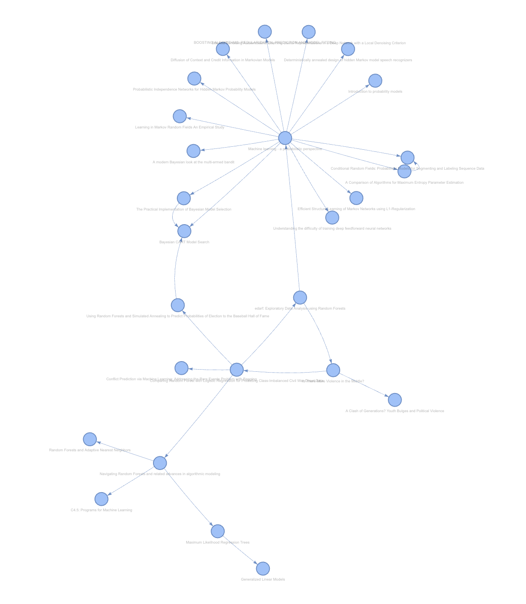

# Statement of work
The goal is to create, from a network graph of research papers, a review of literature using ChatGPT's API. For the first version, I will only be looking at research papers on the topic of tree-based modeling techniques in conflict modeling. 

## Network 
The preliminary network of 26 papers was generated from the origin node of a paper from 2016 titled: "Comparing Random Forest with Logistic Regression for Predicting Class-Imbalanced Civil War Onset Data"
- Note that this means my review of literature will only span up to 2016. Next goal is to recreate this with a more recent paper (and/or expand my network trawler to not only look at references, but also citations for that paper).
- Note^2: nvm i fixed it to also look at citations.

A visualization of the preliminary 26 paper network is below. 

## Prompting
As suggested by GPT: 

"""
I have compiled a list of research papers focusing on the use of tree-based modeling techniques in conflict research. I am seeking a comprehensive literature review based on these papers. The review should highlight key methodologies, findings, and trends over time. Below is a summary of the most significant papers:

1. Title: "Understanding Conflicts through Random Forest Analysis"
   Authors: Smith, J., Doe, A.
   Year: 2019
   Summary: This paper uses random forest models to analyze conflict patterns in region X, revealing insights into...

2. Title: "Gradient Boosting in Predicting Conflict Outcomes"
   Authors: Lee, K., Johnson, M.
   Year: 2021
   Summary: A study that employs gradient boosting methods to predict the outcomes of political conflicts in...

[...additional summaries...]

Please provide a detailed literature review based on these papers, focusing on the methodologies used, the evolution of these techniques over time, and their effectiveness in conflict analysis.
"""

## Result
[not yet done]