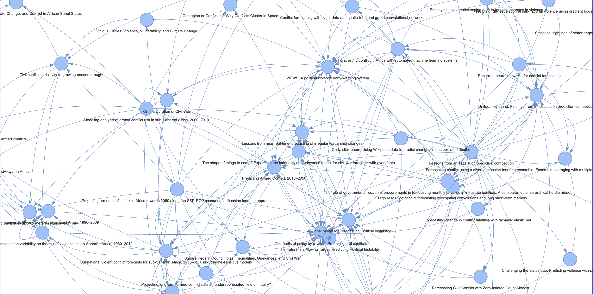

# Research Network of Machine Learning in Conflict Prediction
## Statement of Work
I want to be able to give this thing a few papers and generate a network analysis of the field of research (for a small field like conflict forecasting, this should be feasible). The main things I could be looking for:
- What are the seminal papers? What is most worth reading?
- What are the most commonly used machine learning methods? 
- The most commonly used datasets?

## Some examples
There's nothing new under the sun:
- https://www.connectedpapers.com/
- https://www.researchrabbit.ai/ (spotify for papers?)

## GPT generated guide
Creating a computer program to map out prominent papers in the field of machine learning and conflict prediction, clustering them by techniques, and connecting them through citations is a multi-step process that involves a combination of data retrieval, natural language processing, machine learning, and network analysis. Here's a high-level breakdown of how you could start writing this program:

### Step 1: Define Your Objective and Scope
- **Objective**: To create a visual network analysis of papers, clustered by machine learning techniques and linked by citations.
- **Scope**: Determine the range of years, journals, and conferences from which you want to collect papers.

### Step 2: Data Collection
- **Literature Database Access**: Use APIs from databases like PubMed, IEEE Xplore, or Scopus to collect papers.
- **Web Scraping**: If APIs are not available, you could use web scraping tools (like Beautiful Soup in Python) to collect data from online databases.
- **PDF Parsing**: Use tools like PyPDF2 to extract text from PDFs if you have access to full papers.

### Step 3: Data Preprocessing
- **Metadata Extraction**: Extract metadata such as titles, authors, publication dates, and abstracts.
- **Citation Parsing**: Extract references from each paper. This might require custom parsing algorithms if the format is not standardized.

### Step 4: Text Analysis and Machine Learning Algorithm Identification
- **Natural Language Processing (NLP)**: Use NLP libraries (like NLTK or spaCy in Python) to process the abstracts and full text.
- **Algorithm Identification**: Develop a classifier or use keyword matching to identify the machine learning algorithm used in each paper. This could involve training a model on a labeled dataset where the algorithms are already identified.

### Step 5: Building the Network
- **Graph Creation**: Use a graph library (like NetworkX in Python) to create nodes for each paper and edges for citations.
- **Clustering**: Implement clustering algorithms to group papers based on similarities in their machine learning techniques.
- **Visualization**: Use visualization libraries (like Matplotlib for basic, or Gephi for advanced visualizations) to create the network graph.

### Step 6: Iteration and Refinement
- **User Interface**: If desired, create a user interface to interact with the network (using frameworks like Dash or Streamlit).
- **Feedback Loop**: Incorporate a way to refine your algorithm and clustering based on user feedback or new papers.

### Step 7: Legal and Ethical Considerations
- **Copyright**: Ensure you have the right to scrape and use the data.
- **Privacy**: Respect author privacy and do not misuse contact information.
- **Data Sharing**: If you plan to share the dataset, ensure it complies with the terms of use of the databases.

### Step 8: Documentation and Sharing
- **Documentation**: Write clear documentation on how to use the program and interpret the network.
- **Sharing**: Share your code on platforms like GitHub and write a paper or a blog post about your methodology and findings.

### Programming Languages and Libraries You Might Use:
- Python: Due to its rich set of libraries for data science and machine learning.
- Libraries: BeautifulSoup, PyPDF2, NLTK, spaCy, NetworkX, scikit-learn, Matplotlib, Dash, Streamlit.
